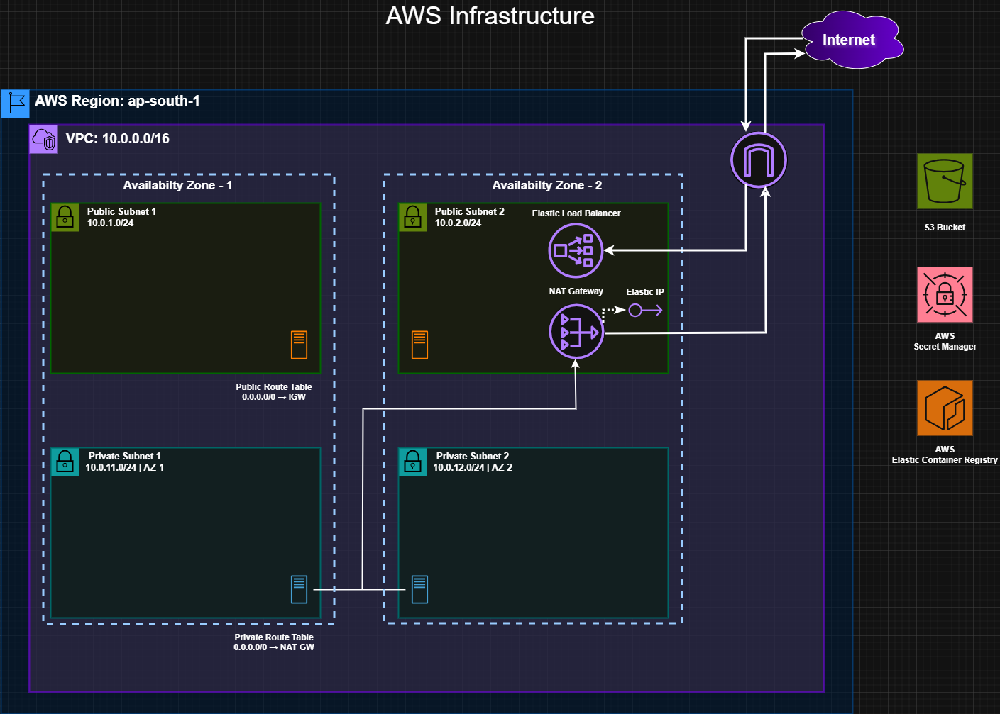

# GTNGame Infrastructure

Production-ready EKS cluster with ArgoCD for GitOps deployments.

## Architecture Diagram


## How This Fits in the Project

This is **one of three repositories** that make up the complete infrastructure:

| Repository | Purpose | Technology |
|------------|---------|------------|
| **[GTNGame_infra-repo](https://github.com/guylaiter/GTNGame_infra-repo)** ← You are here | AWS infrastructure provisioning | Terraform, EKS, VPC, ArgoCD |
| **[GTNGame_app-repo](https://github.com/guylaiter/GTNGame_app-repo)** | Application source code & CI/CD | Flask, PostgreSQL, GitHub Actions |
| **[GTNGame_cluster-repo](https://github.com/guylaiter/GTNGame_cluster-repo)** | Kubernetes manifests & GitOps | Helm, ArgoCD, K8s |

## Prerequisites

- Terraform >= 1.5
- kubectl
- ArgoCD CLI
- GitHub CLI (gh) - optional, for automatic GitHub secrets
- AWS CLI configured with credentials
- netcat (nc) - for port-forward health checks

## Quick Setup

### 1. Create EKS Cluster
```bash
cd terraform
terraform init
terraform apply
```

**Note:** This creates:
- EKS cluster in ap-south-1 (Mumbai)
- VPC with public/private subnets
- NAT Gateway 
- 2 t3a.medium worker nodes

**Time:** ~10-15 minutes

### 2. Configure kubectl
```bash
aws eks update-kubeconfig --region ap-south-1 --name GTNGame-Cluster
```

Verify cluster connection:
```bash
kubectl get nodes
```
**Expected:** 2 nodes in `Ready` status

### 3. Install and Configure ArgoCD (All-in-One)
```bash
cd ../scripts
bash setup-argocd-complete.sh
```

**Alternative (if you prefer):**
```bash
chmod +x setup-argocd-complete.sh
./setup-argocd-complete.sh
```

**This single script will:**
- ✅ Install ArgoCD
- ✅ Enable API key capability
- ✅ Start port-forward in background
- ✅ Generate ArgoCD token
- ✅ Add secrets to GitHub (ARGOCD_TOKEN, ARGOCD_SERVER)

**Time:** ~3-5 minutes

## Access ArgoCD UI

**URL:** https://localhost:8080  
**Username:** `admin`  
**Password:** Shown at end of setup script, or get with:
```bash
kubectl -n argocd get secret argocd-initial-admin-secret -o jsonpath='{.data.password}' | base64 -d
```

**Note:** Port-forward runs in background. To restart:
```bash
kubectl port-forward svc/argocd-server -n argocd 8080:443
```

## Verify Setup

Check ArgoCD pods are running:
```bash
kubectl get pods -n argocd
```

Check GitHub secrets were added:
```bash
gh secret list -R guylaiter/GTNGame_app-repo
```
**Expected:** ARGOCD_TOKEN, ARGOCD_SERVER

## Repository Structure
```
.
├── terraform/                    # Infrastructure as Code
│   ├── versions.tf               # Terraform/provider versions
│   ├── variables.tf              # Input variables
│   ├── main.tf                   # Provider config
│   ├── vpc.tf                    # VPC and networking
│   ├── eks.tf                    # EKS cluster and node group
│   ├── secrets-manager.tf        # IAM permissions for AWS Secrets Manager
│   └── outputs.tf                # Outputs (cluster name, region, etc.)
├── scripts/                      # Setup scripts
│   ├── setup-argocd-complete.sh  # All-in-one ArgoCD setup
│   └── install-secrets-csi-driver.sh  # AWS Secrets Store CSI Driver installation
└── README.md                     # This file
```

## Troubleshooting

### Port-forward not working
```bash
# Kill existing port-forward
lsof -ti:8080 | xargs kill -9

# Restart
kubectl port-forward svc/argocd-server -n argocd 8080:443
```

### ArgoCD pods not ready
```bash
# Check pod status
kubectl get pods -n argocd

# Check specific pod logs
kubectl logs -n argocd <pod-name>
```

### Can't connect to cluster
```bash
# Reconfigure kubectl
aws eks update-kubeconfig --region ap-south-1 --name GTNGame-Cluster

# Test connection
kubectl cluster-info
```

## Teardown

**Destroy infrastructure:**
```bash
cd terraform
terraform destroy
```

**Note:** This deletes everything including ArgoCD. You'll need to re-run the setup script after recreating the cluster.

## Cost Estimate

- EKS Control Plane: ~$73/month
- 2x t3a.medium nodes: ~$54/month ($27 each)
- NAT Gateway: ~$32/month
- **Total: ~$159/month**

## Related Documentation

- **Application Code:** See [GTNGame_app-repo](https://github.com/guylaiter/GTNGame_app-repo)
- **Cluster Configuration:** See [GTNGame_cluster-repo](https://github.com/guylaiter/GTNGame_cluster-repo)
- **Terraform AWS Provider:** https://registry.terraform.io/providers/hashicorp/aws/latest/docs
- **ArgoCD Documentation:** https://argo-cd.readthedocs.io/
